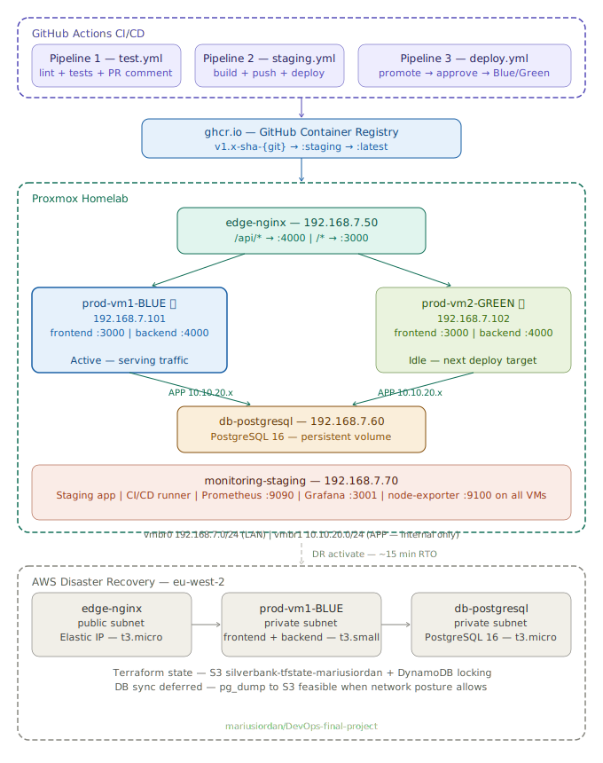

# SilverBank DevOps Infrastructure

> Production-grade CI/CD ecosystem for a 3-tier banking application — provisioned with Terraform, configured with Ansible, containerized with Docker, and deployed via GitHub Actions using a Blue/Green strategy on a Proxmox homelab, with AWS as a fully automated disaster recovery environment activatable in under 15 minutes.

---

## Table of Contents

- [Architecture Overview](#architecture-overview)
- [Tech Stack](#tech-stack)
- [Infrastructure (Terraform)](#infrastructure-terraform)
- [Configuration (Ansible)](#configuration-ansible)
- [Application (Docker)](#application-docker)
- [CI/CD Pipelines (GitHub Actions)](#cicd-pipelines-github-actions)
- [Blue/Green Deployment](#bluegreen-deployment)
- [Monitoring](#monitoring)
- [Database & Persistence](#database--persistence)
- [AWS Disaster Recovery](#aws-disaster-recovery)
- [Secrets Management](#secrets-management)
- [Getting Started](#getting-started)
- [Disaster Recovery Runbook](#disaster-recovery-runbook)
- [Status](#status)

---

## Architecture Overview



### AWS Disaster Recovery Environment

```
Internet
    │
    ▼
edge-nginx (Elastic IP — static across destroy/apply cycles)
    │
    ├── /api/* → prod-vm1-BLUE (private subnet) :4000
    └── /*     → prod-vm1-BLUE (private subnet) :3000
                      │
                      ▼
               db-postgresql (private subnet) :5432
```

Private VMs accessible only via SSH ProxyJump through edge (bastion pattern).
Terraform state stored in S3 — infrastructure reproducible from any machine in ~15 minutes.

### 3-Tier Application Architecture

| Tier | Container | Port | Technology |
|---|---|---|---|
| Frontend | `silverbank-frontend` | 3000 | Next.js 16 (React) |
| Backend | `silverbank-backend` | 4000 | Express.js + Prisma |
| Database | `silverbank-db` / `postgres` | 5432 | PostgreSQL 16 |

Nginx routes traffic based on path:
- `/api/*` → backend container (Express API)
- `/*` → frontend container (Next.js)

### Network Design

Each Proxmox VM has two network interfaces for security isolation:

| Interface | Network | Purpose |
|---|---|---|
| `vmbr0` | `192.168.7.0/24` (LAN) | External access, SSH, management |
| `vmbr1` | `10.10.20.0/24` (APP) | Internal app ↔ DB communication only |

The database is **not reachable from LAN** — only from the APP network. On AWS, equivalent isolation is achieved via VPC public/private subnets and Security Groups.

---

## Tech Stack

| Layer | Technology | Purpose |
|---|---|---|
| Hypervisor | Proxmox VE | Host for all VMs |
| Provisioning | Terraform + bpg/proxmox provider | Create and manage VMs declaratively |
| Configuration | Ansible + Ansible Vault | Configure VMs and deploy encrypted secrets |
| Containerization | Docker + docker-compose | Run all services in isolated containers |
| Registry | GitHub Container Registry (ghcr.io) | Store, version, and promote Docker images |
| Reverse Proxy | Nginx | Route traffic, Blue/Green upstream switching |
| Database | PostgreSQL 16 | Application database with persistent volume |
| Frontend | Next.js 16 | SilverBank UI (React) |
| Backend | Express.js + Prisma | SilverBank REST API |
| CI/CD | GitHub Actions | Automated testing, building, and deployment |
| Monitoring | Prometheus + Grafana + Loki | Metrics, dashboards, log aggregation |
| Metrics Agent | node-exporter | System metrics on all 5 VMs |
| DR Environment | AWS EC2 + VPC + S3 | Full infrastructure disaster recovery |
| State Backend | AWS S3 + DynamoDB | Remote Terraform state with locking |

---

## Infrastructure (Terraform)

### Proxmox

Terraform provisions all VMs from a single Ubuntu 24.04 template using `for_each`. After apply, it automatically generates `ansible/inventory.ini` with the correct IPs and SSH configuration.

#### Active VM Layout

| VM | VMID | LAN IP | APP IP | Specs | Role |
|---|---|---|---|---|---|
| `edge-nginx` | 850 | 192.168.7.50 | 10.10.20.10 | 2 vCPU / 2GB | Primary reverse proxy |
| `prod-vm1-BLUE` | 810 | 192.168.7.101 | 10.10.20.11 | 2 vCPU / 4GB | Production (Blue) |
| `prod-vm2-GREEN` | 811 | 192.168.7.102 | 10.10.20.12 | 2 vCPU / 4GB | Production (Green) |
| `db-postgresql` | 860 | 192.168.7.60 | 10.10.20.20 | 2 vCPU / 4GB | Primary database |
| `monitoring-staging` | 800 | 192.168.7.70 | 10.10.20.30 | 2 vCPU / 4GB | Staging + CI/CD runner + Monitoring |

#### Project Structure

```
proxmox-silverbank/
├── main.tf                   # VM resources (for_each on locals.vms)
├── variables.tf              # variable declarations
├── outputs.tf                # outputs + auto-generates ansible/inventory.ini
├── ansible.tf                # generates group_vars with dynamic IPs
├── s3-lifecycle.tf           # S3 lifecycle rules for db-backups retention
├── terraform.tfvars          # actual values — NOT in git
└── terraform.tfvars.example  # example values — safe to commit
```

#### Quick Start

```bash
cd proxmox-silverbank/terraform
terraform init
terraform plan
terraform apply -parallelism=3
terraform destroy -parallelism=3
```

### AWS

AWS infrastructure mirrors Proxmox with a simplified single-VM production setup. Terraform state is stored remotely in S3 with DynamoDB locking — the entire environment can be reprovisioned from any machine in approximately 15 minutes.

#### AWS VM Layout

| VM | Subnet | Instance Type | Role |
|---|---|---|---|
| `edge-nginx` | Public | t3.micro | Reverse proxy + SSH bastion |
| `prod-vm1-BLUE` | Private | t3.small | Production app (frontend + backend) |
| `db-postgresql` | Private | t3.micro | PostgreSQL database |

#### Remote State (S3 Backend)

```hcl
terraform {
  backend "s3" {
    bucket         = "silverbank-tfstate-mariusiordan"
    key            = "aws-silverbank/terraform.tfstate"
    region         = "eu-west-2"
    dynamodb_table = "silverbank-tf-locks"
    encrypt        = true
  }
}
```

> ⚠️ **Cost warning:** NAT Gateway costs ~$33/month. Always run `terraform destroy` when done.

#### S3 Backup Retention

Database backups are stored in `s3://silverbank-tfstate-mariusiordan/db-backups/` and automatically deleted after 30 days via an S3 lifecycle rule defined in `s3-lifecycle.tf`.

```
backup_20260325_221318_v1.0-sha-0dcbd3d.sql
│      │                 └── image tag — links backup to exact deployment
│      └── timestamp — when backup was taken
└── prefix — used by lifecycle rule to auto-expire after 30 days
```

---

## Configuration (Ansible)

Ansible configures each VM based on its role. Inventory is auto-generated by Terraform.

### Proxmox Structure

```
proxmox-silverbank/ansible/
├── ansible.cfg
├── inventory.ini                     # auto-generated by Terraform
├── files/
│   ├── docker-compose.staging.yml    # 3-tier compose for staging (with local DB)
│   └── docker-compose.prod.yml       # 2-tier compose for prod (uses dedicated DB VM)
├── group_vars/
│   ├── all/
│   │   ├── main.yml                  # global vars (IPs, ports, docker user)
│   │   └── vault.yml                 # ENCRYPTED secrets (Ansible Vault)
│   ├── prod.yml                      # frontend/backend images + DB connection
│   ├── db.yml                        # PostgreSQL vars
│   └── monitoring.yml                # staging vars (uses local DB container)
├── roles/
│   ├── common/                       # all VMs: Docker, UFW, node-exporter, AWS CLI, timezone
│   ├── nginx/                        # edge: nginx + upstream config + switch script
│   ├── postgres/                     # db: PostgreSQL 16 in Docker + persistent volume
│   ├── app/                          # blue+green: pull images, write .env, start containers
│   └── monitoring/                   # staging: Prometheus + Grafana + Loki
└── playbooks/
    ├── site.yml                      # full setup from scratch
    ├── deploy-idle.yml               # deploy to idle Blue/Green environment
    ├── smoke-tests.yml               # health checks on idle environment (bypass nginx)
    ├── switch-traffic.yml            # switch nginx upstream to new environment
    ├── deploy-staging.yml            # deploy 3-tier to staging VM
    ├── rollback.yml                  # monitor 10min + auto rollback if unhealthy
    └── db-failover.yml               # emergency: switch app to DB replica
```

### Roles

| Role | Target VMs | What it does |
|---|---|---|
| `common` | All VMs | Docker, UFW firewall, node-exporter, AWS CLI, packages, UTC timezone |
| `nginx` | edge-nginx | Nginx, upstream config, Blue/Green switch script |
| `postgres` | db-postgresql | PostgreSQL 16 in Docker, persistent volume |
| `app` | blue, green | Pull Docker images from ghcr.io, write `.env`, start containers |
| `monitoring` | monitoring-staging | Prometheus + Grafana + Loki stack |

> **Note:** AWS CLI is installed via the `common` role so it is available on the self-hosted runner after any infrastructure rebuild — no manual steps required.

### Usage

```bash
cd proxmox-silverbank/ansible

# Test connectivity
ansible all -m ping -i inventory.ini

# Full setup from scratch
ansible-playbook playbooks/site.yml -i inventory.ini

# Configure specific VMs only
ansible-playbook playbooks/site.yml --limit edge-nginx -i inventory.ini
ansible-playbook playbooks/site.yml --limit prod -i inventory.ini
ansible-playbook playbooks/site.yml --limit db -i inventory.ini
ansible-playbook playbooks/site.yml --limit stage-monitoring -i inventory.ini
```

---

## Application (Docker)

SilverBank is a 3-tier application split into separate Docker images for frontend and backend. Each image is built independently, tagged with a unique identifier, and stored in GitHub Container Registry.

### Image Naming

```
ghcr.io/mariusiordan/silverbank-frontend:<tag>
ghcr.io/mariusiordan/silverbank-backend:<tag>
```

Tag format: `v{MAJOR}.{MINOR}-sha-{git-sha}`

Examples:
- `v1.0-sha-abc1234` — staging build, promoted to production unchanged
- `latest` — most recent stable production image (promoted after 10-minute health check)

The version component (`v1.0`, `v1.1`, `v2.0`) is managed manually and incremented when releasing new features or breaking changes. The SHA component is generated automatically from the git commit, making every tag immutable and fully traceable.

### Image Promotion Flow

```
staging.yml builds image → tags as :v1.x-sha-{sha} + :staging
deploy.yml promotes :staging → :v1.x-sha-{sha} (retag, no rebuild)
After 10-minute health check → promotes to :latest (used by AWS DR)
```

No image is ever rebuilt between staging and production — the exact artifact tested on staging is what gets deployed to production.

### docker-compose Files

| File | Used for | Includes DB? |
|---|---|---|
| `docker-compose.yml` | Local development | ✅ Yes |
| `docker-compose.staging.yml` | Staging VM | ✅ Yes (local container) |
| `docker-compose.prod.yml` | Production VMs | ❌ No (dedicated DB VM) |

### Multi-stage Dockerfiles

**Frontend (`Dockerfile`):**
```
Stage 1 (builder) → npm ci, npm run build (Next.js)
Stage 2 (runner)  → copy .next/standalone, node server.js
```

**Backend (`backend/Dockerfile`):**
```
Stage 1 (builder) → npm ci, prisma generate, tsc (TypeScript compile)
Stage 2 (runner)  → copy dist/, prisma migrate deploy, node dist/index.js
```

### Health Endpoint

The backend exposes `/api/health` which returns full deployment metadata:

```json
{
  "status": "ok",
  "timestamp": "2026-03-25T22:00:00.000Z",
  "database": "connected",
  "version": "1.0.0",
  "environment": "blue",
  "image_tag": "v1.0-sha-abc1234"
}
```

This allows instant traceability — from a running container back to the exact git commit that produced it. The `environment` and `image_tag` fields are injected at deploy time by Ansible as environment variables.

---

## CI/CD Pipelines (GitHub Actions)

Three distinct pipelines covering the full software delivery lifecycle.

### CI/CD Tool Choice

The project uses **GitHub Actions** instead of Jenkins. GitHub Actions eliminates the need for a dedicated Jenkins server, provides Pipeline-as-Code natively via YAML, and integrates directly with the container registry and repository. The same pipeline principles apply — trigger-based workflows, parallel stages, and deployment gates.

A **self-hosted runner** is installed on `monitoring-staging` (192.168.7.70). This is required because deployment jobs need direct SSH access to the internal `10.10.20.x` network — something a cloud-based runner cannot do.

### Branch Strategy

| Branch | Purpose | Workflow triggered |
|---|---|---|
| `dev` | Active development | `test.yml` — lint + tests on PR only |
| `staging` | Pre-production validation | `staging.yml` — build + deploy + integration tests |
| `main` | Production | `deploy.yml` — promote image + manual approval + Blue/Green |

---

### Pipeline 1 — Continuous Integration (`test.yml`)

**Trigger:** Pull Request to `staging` or `main`

```
lint (ESLint)
  ├── JWT Tests     ──► validates token generation and verification
  ├── Auth Tests    ──► tests login and registration flows
  └── Account Tests ──► tests account management operations

All 3 test suites run IN PARALLEL after lint passes.
If any test fails → automatic comment posted on PR + merge blocked.
```

Auth and Account tests run inside a Docker container to guarantee a consistent environment matching production builds.

---

### Pipeline 2 — Staging Deployment (`staging.yml`)

**Trigger:** Push to `staging` branch

```
lint
  ├── JWT Tests      ┐
  ├── Auth Tests     ├──► Build Docker images ──► Push to ghcr.io
  └── Account Tests  ┘    (tag: v1.x-sha-{sha} + :staging)
                                    │
                                    ▼
                         Deploy to monitoring-staging VM
                         (3-tier: frontend + backend + local PostgreSQL)
                                    │
                                    ▼
                         Integration Tests (self-hosted runner):
                           ✅ GET  /api/health        → database connected
                           ✅ POST /api/auth/register  → HTTP 201
                           ✅ POST /api/auth/login     → HTTP 200
                           ✅ DELETE /api/auth/delete  → cleanup
```

Staging uses an **isolated local PostgreSQL container** — it does not connect to the production database.

---

### Pipeline 3 — Production Deployment (`deploy.yml`)

**Trigger:** Push to `main` branch

```
Promote Image
  (retag :staging → :v1.x-sha-{sha}, no rebuild)
    │
    ▼
Manual Approval ⏳
  (release manager approves via GitHub Environments)
    │
    ▼
Detect Active Environment
  (SSH to edge-nginx → read /opt/current-env → identify BLUE or GREEN)
  (defaults to green if file missing — e.g. after fresh rebuild)
    │
    ▼
Backup Database to S3                          ← NEW
  (pg_dump → scp to runner → upload to S3)
  (filename: backup_{timestamp}_{image_tag}.sql)
  (auto-deleted after 30 days via S3 lifecycle)
    │
    ▼
Deploy to Idle Environment
  (pull new image, start containers — traffic still on active env)
    │
    ▼
Smoke Tests on Idle
  (direct HTTP to idle VM, bypassing nginx — no user impact)
    │
    ▼
Switch Nginx Traffic                           ← now a separate job
  (/opt/switch-backend.sh [blue|green])
    │
    ▼
    ├── Monitor (10 minutes, every 30 seconds) ← runs in parallel
    │     ├── stable → Production Health Check ✅
    │     │             promote image to :latest
    │     └── failed → Rollback              ← separate job, only if monitor fails
    │                   switch back to previous env
    │                   pipeline fails ❌
    │
    ▼
Update AWS DR (suspended — activate manually for DR demo)
```

#### Why separate Switch, Monitor, and Rollback into distinct jobs?

Previously these three steps were combined in a single job `switch-monitor-rollback`. Separating them provides:

- **Better visibility** — each step is clearly labelled in GitHub Actions UI
- **Conditional execution** — rollback only runs if monitor fails (`if: needs.monitor.outputs.stable == 'false'`)
- **Cleaner failure reporting** — you can see exactly which step caused the pipeline to fail

#### Database Backup Design

A `pg_dump` is taken **before every production deployment** and uploaded to S3:

```
s3://silverbank-tfstate-mariusiordan/db-backups/
└── backup_20260325_221318_v1.0-sha-0dcbd3d.sql
```

The filename includes the image tag — so you always know which backup corresponds to which deployment. If a deployment goes wrong, you know exactly which backup to restore from.

Backups are automatically deleted after 30 days via an S3 lifecycle rule.

### Required GitHub Secrets

| Secret | Description |
|---|---|
| `GHCR_TOKEN` | GitHub PAT with `write:packages` permission |
| `PROXMOX_SSH_KEY` | Private SSH key for Proxmox VMs |
| `VAULT_PASSWORD` | Ansible Vault decryption password |
| `AWS_ACCESS_KEY_ID` | AWS IAM credentials for S3 backup upload + Terraform |
| `AWS_SECRET_ACCESS_KEY` | AWS IAM credentials for S3 backup upload + Terraform |

### Self-Hosted Runner

All deployment jobs run on a self-hosted GitHub Actions runner installed on `monitoring-staging` (192.168.7.70).

```bash
# Check runner status
ssh devop@192.168.7.70
sudo systemctl status actions.runner.mariusiordan-SilverBank-App.monitoring-staging.service

# Reinstall after full infrastructure rebuild
# Go to GitHub → SilverBank-App → Settings → Actions → Runners → New runner
sudo ./svc.sh install && sudo ./svc.sh start
```

---

## Blue/Green Deployment

Traffic is controlled by Nginx upstream configuration on the edge VM. Only one environment serves live traffic at any time — the other remains on standby for instant rollback.

```nginx
# Active configuration example (BLUE serving traffic)
upstream app_frontend {
    server 10.10.20.11:3000;   # BLUE frontend — active
    # server 10.10.20.12:3000; # GREEN frontend — inactive
}
upstream app_backend_api {
    server 10.10.20.11:4000;   # BLUE backend API — active
    # server 10.10.20.12:4000; # GREEN backend API — inactive
}
```

```
┌──────────────────────────────────────────────────────────────────────┐
│                         Blue/Green Flow                              │
│                                                                      │
│  1. Read /opt/current-env on edge → identify active environment      │
│  2. Derive idle environment (opposite of active)                     │
│  3. pg_dump database → upload to S3 (safety net)                    │
│  4. Deploy new images to IDLE VM (zero user impact)                  │
│  5. Smoke test directly on IDLE (bypassing nginx)                    │
│  6. Switch nginx upstreams → IDLE becomes LIVE                       │
│     /opt/switch-backend.sh [blue|green]                              │
│  7. Monitor for 10 minutes (health check every 30 seconds)           │
│     ✅ stable → promote to :latest, old env stays as fallback        │
│     ❌ 3 consecutive failures → auto-rollback to previous env        │
└──────────────────────────────────────────────────────────────────────┘
```

### Manual Traffic Control

```bash
ssh devop@192.168.7.50

# Switch traffic
sudo /opt/switch-backend.sh green    # route to GREEN
sudo /opt/switch-backend.sh blue     # route to BLUE (manual rollback)

# Check active environment
cat /opt/current-env

# View switch history
sudo cat /var/log/nginx/switches.log
```

### Ansible Playbooks

```bash
cd proxmox-silverbank/ansible

# Deploy to idle environment
ansible-playbook playbooks/deploy-idle.yml \
  -e "app_tag=v1.0-sha-abc1234" \
  -e "idle_env=blue" \
  -i inventory.ini

# Run smoke tests on idle environment
ansible-playbook playbooks/smoke-tests.yml \
  -e "idle_env=blue" \
  -i inventory.ini

# Switch nginx traffic
ansible-playbook playbooks/switch-traffic.yml \
  -e "idle_env=blue" \
  -i inventory.ini

# Monitor + auto-rollback (10 minutes)
ansible-playbook playbooks/rollback.yml \
  -e "app_tag=v1.0-sha-abc1234" \
  -e "new_env=blue" \
  -e "previous_env=green" \
  -i inventory.ini
```

---

## Monitoring

Prometheus, Grafana, and Loki run on the `monitoring-staging` VM. node-exporter is installed on all 5 VMs via the `common` Ansible role, giving full visibility across the entire infrastructure.

### Stack

| Component | Port | Purpose |
|---|---|---|
| Prometheus | 9090 | Metrics collection and storage (scrapes every 15s) |
| Grafana | 3001 | Dashboards and visualization |
| Loki | 3100 | Log aggregation |
| node-exporter | 9100 | System metrics (CPU, RAM, disk, network) on all VMs |

### Access

```
http://192.168.7.70:3001   # Grafana (admin / vault_grafana_password)
http://192.168.7.70:9090   # Prometheus
http://192.168.7.70:9090/targets  # verify all scrape targets are UP
```

### Scraped Targets

Prometheus scrapes node-exporter on all VMs every 15 seconds:

```
192.168.7.50:9100   edge-nginx
192.168.7.60:9100   db-postgresql
192.168.7.70:9100   monitoring-staging
192.168.7.101:9100  prod-vm1-BLUE
192.168.7.102:9100  prod-vm2-GREEN
```

Port 9100 is firewalled on each VM — only `192.168.7.70` (monitoring VM) can reach it.

### Grafana Setup (after rebuild)

1. Go to `http://192.168.7.70:3001` → Connections → Data Sources → Add → Prometheus
2. URL: `http://localhost:9090` → Save & Test
3. Dashboards → New → Import → ID `1860` → Load → Import
4. Use the `nodename` dropdown to switch between VMs

---

## Database & Persistence

The database runs on a dedicated VM with a persistent Docker volume. The application database is **never touched during deployment** — only frontend and backend containers are redeployed.

### Production DB

```
db-postgresql (192.168.7.60 / 10.10.20.20)
  └── postgres:16-alpine container
      └── /opt/postgres/data (persistent volume — survives container restarts and VM reboots)
```

### Automated Backups

Before every production deployment, a `pg_dump` is taken and uploaded to S3:

```bash
# Manual backup (same as what the pipeline does)
ssh devop@192.168.7.60 \
  "docker exec postgres pg_dump -U devop_db appdb > /tmp/backup_manual.sql"
scp devop@192.168.7.60:/tmp/backup_manual.sql /tmp/backup_manual.sql
aws s3 cp /tmp/backup_manual.sql \
  s3://silverbank-tfstate-mariusiordan/db-backups/backup_manual.sql

# List all backups in S3
aws s3 ls s3://silverbank-tfstate-mariusiordan/db-backups/

# Restore from a backup
scp /tmp/backup.sql devop@192.168.7.60:/tmp/backup.sql
ssh devop@192.168.7.60 \
  "docker exec -i postgres psql -U devop_db appdb < /tmp/backup.sql"
```

### Staging DB

On staging, PostgreSQL runs as a local container alongside frontend and backend — completely isolated from production:

```yaml
# docker-compose.staging.yml
services:
  db:       # local PostgreSQL — staging only, NOT shared with production
  backend:  # connects to local db container
  frontend:
```

### DB Failover

```bash
# Emergency: switch all app VMs to use DB replica
ansible-playbook playbooks/db-failover.yml -i inventory.ini
```

---

## AWS Disaster Recovery

The AWS environment is a full duplicate of the Proxmox infrastructure, designed to be activated in approximately 15 minutes when Proxmox is unavailable. It uses a simplified single-VM production setup — Terraform state is stored in S3, so the entire environment can be reprovisioned from any machine with no local state dependency.

### Design Decisions

**Why no Blue/Green on AWS DR?**
DR is activated rarely and temporarily. Adding Blue/Green complexity to a recovery environment increases the risk of mistakes during a stressful outage. A single, stable VM is faster and safer to operate.

**Why no DB sync from Proxmox to AWS?**
The DR environment starts with a clean database. The architecture supports data synchronisation — a scheduled `pg_dump` to S3 from Proxmox, combined with an automatic restore on DR activation, would give the AWS environment a near-identical copy of production data.

This was intentionally not implemented: it requires the Proxmox host to have outbound internet access for S3 uploads, which introduces a network exposure that is not acceptable for a homelab environment at this stage. The implementation path is clear when the security posture allows it.

Considered alternatives:

| Approach | Notes |
|---|---|
| pg_dump to S3 (hourly) | Feasible — deferred for security reasons |
| PostgreSQL streaming replication over VPN | Enterprise-grade, appropriate at larger scale |
| AWS DMS (managed CDC) | ~$50/month, not justified for DR-only use |

### Activate DR

```bash
# Step 1 — provision AWS infrastructure (~5 minutes)
cd aws-silverbank/terraform
terraform apply -auto-approve \
  -var="ssh_public_key=$(cat ~/.ssh/id_ed25519.pub)" \
  -var="your_home_ip=$(curl -4 ifconfig.me)/32"

# Step 2 — configure VMs (~8 minutes)
cd ../ansible
ansible-playbook playbooks/site.yml -i inventory-aws.ini

# Step 3 — verify
curl http://$(cd ../terraform && terraform output -raw edge_elastic_ip)/api/health
```

### Deactivate DR

```bash
cd aws-silverbank/terraform
terraform destroy -auto-approve \
  -var="ssh_public_key=$(cat ~/.ssh/id_ed25519.pub)" \
  -var="your_home_ip=$(curl -4 ifconfig.me)/32"
```

### Auto-Update from CI/CD (suspended)

The production pipeline includes an `aws-update` job that automatically detects whether the AWS DR environment is active and deploys the latest stable image if so. This job is currently suspended to avoid pipeline failures when AWS is not running.

To re-enable, uncomment the `aws-update` job in `.github/workflows/deploy.yml`.

---

## Secrets Management

### Terraform Secrets (`~/.tf-secrets`)

Kept outside the project directory, never committed to git.

```bash
export TF_VAR_proxmox_api_token="root@pam!terraform=xxxx-xxxx"
export TF_VAR_ci_password="your-vm-password"
export TF_VAR_ssh_public_key="ssh-ed25519 AAAA..."

echo 'source ~/.tf-secrets' >> ~/.zshrc && source ~/.zshrc
```

### Ansible Vault (`group_vars/all/vault.yml`)

All application secrets are encrypted at rest using Ansible Vault. The vault password is stored locally at `~/.vault-password` and as a GitHub Actions secret.

```bash
# Edit secrets
ansible-vault edit proxmox-silverbank/ansible/group_vars/all/vault.yml

# View secrets
ansible-vault view proxmox-silverbank/ansible/group_vars/all/vault.yml
```

Secrets managed in vault:
- `vault_db_user` / `vault_db_password` / `vault_postgres_password`
- `vault_jwt_secret` / `vault_ghcr_token`
- `vault_grafana_password`

---

## Getting Started

### Prerequisites

- Proxmox VE with Ubuntu 24.04 template (VMID 9999)
- Terraform >= 1.5
- Ansible >= 2.14
- Docker with buildx
- SSH key pair at `~/.ssh/id_ed25519`
- AWS account with IAM credentials

### 1. Clone the repos

```bash
git clone https://github.com/mariusiordan/DevOps-final-project.git
git clone https://github.com/mariusiordan/SilverBank-App.git
```

### 2. Set up Terraform secrets

```bash
cat > ~/.tf-secrets << 'EOF'
export TF_VAR_proxmox_api_token="root@pam!terraform=YOUR_TOKEN"
export TF_VAR_ci_password="YOUR_VM_PASSWORD"
export TF_VAR_ssh_public_key="$(cat ~/.ssh/id_ed25519.pub)"
EOF
chmod 600 ~/.tf-secrets && source ~/.tf-secrets
```

### 3. Provision VMs

```bash
cd terraform-ansible-infrastructure/proxmox-silverbank/terraform
terraform init && terraform apply -parallelism=3
```

### 4. Set up Ansible Vault password

```bash
echo "your-vault-password" > ~/.vault-password
chmod 600 ~/.vault-password
```

### 5. Configure all VMs

```bash
cd ../ansible
ansible all -m ping -i inventory.ini
ansible-playbook playbooks/site.yml -i inventory.ini
```

### 6. Reinstall GitHub Actions runner

After a full rebuild, the self-hosted runner must be reinstalled:

```bash
# Go to GitHub → SilverBank-App → Settings → Actions → Runners → New runner
# Follow the Linux x64 instructions, then:
sudo ./svc.sh install && sudo ./svc.sh start
```

### 7. Verify

```bash
curl http://192.168.7.50/api/health
# → {"status":"ok","database":"connected","environment":"blue","image_tag":"v1.0-sha-..."}
```

---

## Disaster Recovery Runbook

| Scenario | Action | RTO |
|---|---|---|
| Blue VM down | `sudo /opt/switch-backend.sh green` on edge | ~5 seconds |
| Green VM down | `sudo /opt/switch-backend.sh blue` on edge | ~5 seconds |
| Bad deployment | Auto-rollback after 3 consecutive health check failures | ~1-3 minutes |
| Edge nginx down | Start VM from Proxmox UI | ~2 minutes |
| DB primary down | `ansible-playbook playbooks/db-failover.yml` | ~1 minute |
| Full Proxmox failure | Activate AWS DR environment | ~15 minutes |
| Runner lost after rebuild | Reinstall from GitHub Settings → Actions → Runners | ~5 minutes |
| Restore DB from backup | `aws s3 cp` + `psql` restore | ~5 minutes |

---

## Status

| Component | Environment | Status |
|---|---|---|
| Terraform — VM provisioning | Proxmox (5 VMs) | ✅ Done |
| Terraform — AWS infrastructure + S3 state | AWS (3 VMs + VPC) | ✅ Done |
| S3 lifecycle rule — db-backups 30 day retention | AWS S3 | ✅ Done |
| Common role (Docker, UFW, node-exporter, AWS CLI) | All VMs | ✅ Done |
| Nginx + Blue/Green switch script | edge-nginx | ✅ Done |
| Nginx routing `/api/` → backend, `/` → frontend | edge-nginx | ✅ Done |
| Frontend container (Next.js :3000) | prod-vm1-BLUE, prod-vm2-GREEN | ✅ Done |
| Backend container (Express :4000) | prod-vm1-BLUE, prod-vm2-GREEN | ✅ Done |
| PostgreSQL 16 + persistent volume | db-postgresql | ✅ Done |
| Staging VM — isolated 3-tier deployment | monitoring-staging | ✅ Done |
| Health endpoint — status, environment, image tag | backend | ✅ Done |
| GitHub Actions (vs Jenkins) | Deliberate choice — documented above | ✅ Done |
| Pipeline 1 — CI (lint + parallel tests + PR comment) | GitHub Actions | ✅ Done |
| Pipeline 2 — Staging (build + push + deploy + integration tests) | GitHub Actions | ✅ Done |
| Pipeline 3 — Production (promote + approve + Blue/Green) | GitHub Actions | ✅ Done |
| Database backup to S3 before every deployment | deploy.yml | ✅ Done |
| Blue/Green auto-detection (default green after rebuild) | deploy.yml | ✅ Done |
| Smoke tests before traffic switch | deploy.yml | ✅ Done |
| Switch traffic — separate job | deploy.yml | ✅ Done |
| Monitor (10 min) — separate job with stable output | deploy.yml | ✅ Done |
| Rollback — separate job, only runs on monitor failure | deploy.yml | ✅ Done |
| :latest promotion after stable deployment | rollback.yml | ✅ Done |
| Image tag format — immutable, traceable (v1.x-sha-{git}) | ghcr.io | ✅ Done |
| AWS DR — manual activation (~15 minutes RTO) | aws-silverbank | ✅ Done |
| Terraform state in S3 + DynamoDB locking | aws-silverbank | ✅ Done |
| Prometheus + Grafana + Loki | monitoring-staging | ✅ Done |
| node-exporter on all VMs | All VMs | ✅ Done |
| AWS DR auto-update from CI/CD | deploy.yml | ⏸️ Suspended |
| SSL / Let's Encrypt | edge-nginx | 🔲 Planned |
| DB sync Proxmox → AWS S3 (pg_dump scheduled) | aws-silverbank | 🔲 Planned |

---

## Repo Structure

```
terraform-ansible-infrastructure/
├── proxmox-silverbank/
│   ├── main.tf
│   ├── variables.tf
│   ├── outputs.tf
│   ├── ansible.tf
│   ├── s3-lifecycle.tf            # S3 backup retention rules
│   └── ansible/
│       ├── ansible.cfg
│       ├── inventory.ini          # auto-generated by Terraform
│       ├── files/
│       │   ├── docker-compose.staging.yml
│       │   └── docker-compose.prod.yml
│       ├── group_vars/
│       │   ├── all/
│       │   │   ├── main.yml
│       │   │   └── vault.yml      # encrypted
│       │   ├── prod.yml
│       │   ├── db.yml
│       │   └── monitoring.yml
│       ├── roles/
│       │   ├── common/            # includes AWS CLI install
│       │   ├── nginx/
│       │   ├── postgres/
│       │   ├── app/
│       │   └── monitoring/
│       └── playbooks/
│           ├── site.yml
│           ├── deploy-idle.yml
│           ├── smoke-tests.yml
│           ├── switch-traffic.yml
│           ├── deploy-staging.yml
│           ├── rollback.yml
│           └── db-failover.yml
├── aws-silverbank/
│   ├── terraform/
│   │   ├── main.tf
│   │   ├── versions.tf
│   │   ├── s3-lifecycle.tf        # db-backups 30 day expiry
│   │   ├── variables.tf
│   │   ├── outputs.tf
│   │   └── bootstrap/
│   │       └── main.tf
│   └── ansible/
│       ├── ansible.cfg
│       ├── group_vars/
│       ├── roles/
│       └── playbooks/
│           ├── site.yml
│           └── deploy-production.yml
├── COMMANDS.md
├── BLUE-GREEN.md
└── README.md
```

---

*App repository: [mariusiordan/SilverBank-App](https://github.com/mariusiordan/SilverBank-App)*
*Infrastructure repository: [mariusiordan/DevOps-final-project](https://github.com/mariusiordan/DevOps-final-project)*