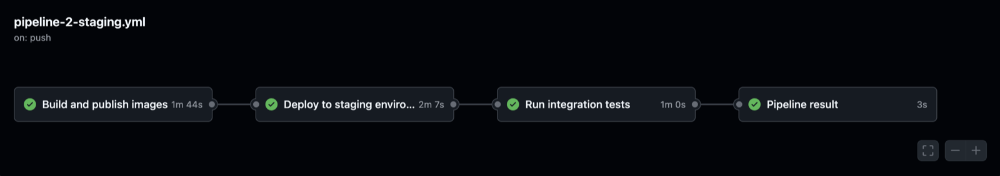
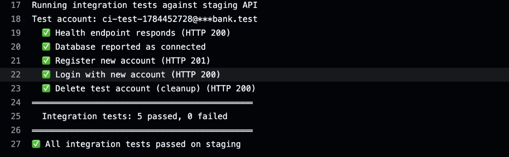
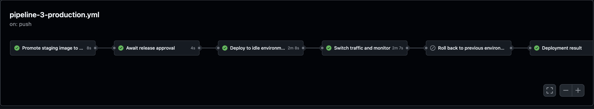
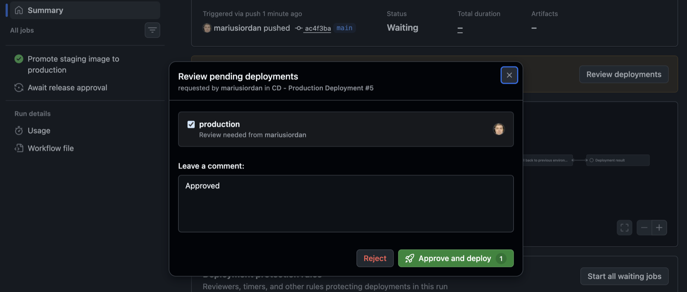
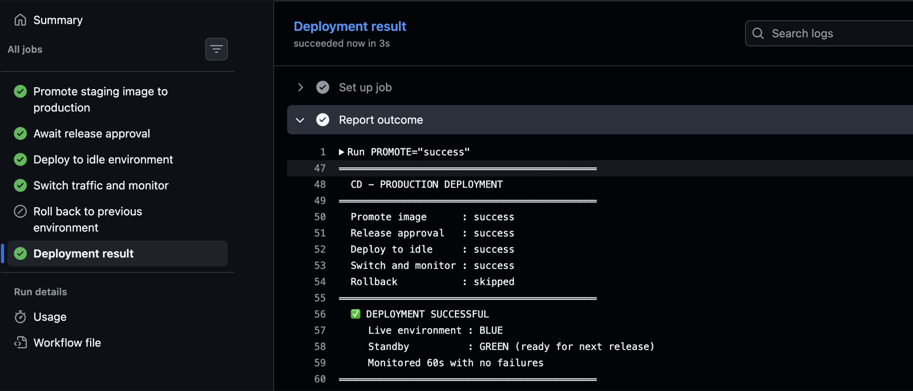
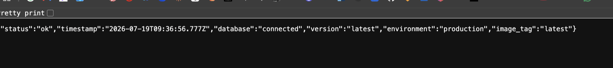
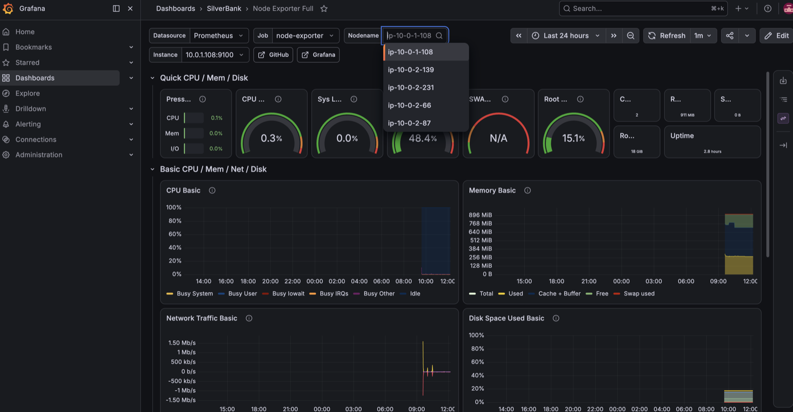

# SilverBank on AWS — Production-Grade CI/CD Platform

A three-tier banking application deployed to AWS EC2 with a full CI/CD platform:
GitHub Actions pipelines, Blue/Green production deployments, an isolated staging
environment, automated database backups, and monitoring — all provisioned as code
with Terraform and Ansible.

**No SSH ports are open. No long-lived AWS credentials exist anywhere.**
Deployments reach private instances through AWS Systems Manager, and the CI
pipelines authenticate to AWS using short-lived OIDC tokens.

| | |
|---|---|
| **Application** | Next.js 15 · Express · Prisma · PostgreSQL 16 |
| **Infrastructure** | Terraform · AWS EC2, VPC, IAM, S3, SSM |
| **Configuration** | Ansible (over SSM, not SSH) |
| **CI/CD** | GitHub Actions · GHCR |
| **Observability** | Prometheus · Grafana · Loki · node_exporter |
| **Region** | `eu-west-2` (London) |

---

## Table of contents

1. [Where this project came from](#where-this-project-came-from)
2. [Architecture](#architecture)
3. [How a change reaches production](#how-a-change-reaches-production)
4. [The three pipelines](#the-three-pipelines)
5. [Design decisions](#design-decisions)
6. [Security posture](#security-posture)
7. [Repository layout](#repository-layout)
8. [Getting started](#getting-started)
9. [Operations runbook](#operations-runbook)
10. [Cost notes](#cost-notes)
11. [Known limitations](#known-limitations)

---

## Where this project came from

This is the second iteration of the SilverBank platform.

The **first iteration** ([`proxmox-silverbank/`](../proxmox-silverbank/)) was built on a
Proxmox homelab and submitted as the final project for a DevOps accreditation
programme. It established the core ideas: a three-tier application in Docker, Blue/Green
deployments behind nginx, three GitHub Actions pipelines, and Prometheus/Grafana
monitoring. It used SSH with a self-hosted runner, and treated AWS only as a
disaster-recovery target.

This **AWS iteration** rebuilds the same application on cloud infrastructure and
replaces the parts that would not hold up in a production environment:

| Concern | Proxmox iteration | AWS iteration |
|---|---|---|
| Reaching the servers | SSH from a self-hosted runner | AWS SSM from GitHub-hosted runners |
| Open inbound ports | SSH (22) on the bastion | none — only HTTP on the edge |
| AWS credentials in CI | static access keys in GitHub secrets | OIDC federation, ~1 h temporary credentials |
| Runner | self-hosted (a VM that must stay alive) | GitHub-hosted (ephemeral, nothing to maintain) |
| Staging environment | dedicated VM | isolated 3-tier stack with its own database |
| Grafana configuration | configured by hand in the UI | provisioned as code, survives rebuilds |

The goal was not to pass a course a second time. It was to take a working system and
ask, for each moving part, *"would this survive a security review?"* — then fix what
would not.

---

## Architecture

### Network

```
                          Internet
                              │
                              │  HTTP :80
                    ┌─────────▼──────────┐
   Public subnet    │     edge-nginx     │  Elastic IP
   10.0.1.0/24      │   reverse proxy    │  the only public entry point
                    └─────────┬──────────┘
                              │
        ┌──────────────┬──────┴───────┬──────────────────┐
        │              │              │                  │
┌───────▼──────┐┌──────▼───────┐┌─────▼────────┐┌────────▼─────────┐
│ prod-vm1-BLUE││prod-vm2-GREEN││ db-postgresql││monitoring-staging│
│  :3000 :4000 ││  :3000 :4000 ││    :5432     ││ Prometheus :9090 │
│              ││              ││              ││ Grafana    :3001 │
│   ACTIVE     ││   STANDBY    ││  PostgreSQL  ││ Loki       :3100 │
│              ││              ││   + backups  ││ staging stack    │
└──────────────┘└──────────────┘└──────────────┘└──────────────────┘
                    Private subnet 10.0.2.0/24
                  no public IPs · no inbound internet
```

Only `edge-nginx` sits in the public subnet. Everything else is unreachable from the
internet. Outbound traffic (pulling container images, reaching the SSM endpoint) goes
through a NAT Gateway.

### Traffic flow

`edge-nginx` runs a reverse proxy that routes by path:

- `/api/*` → backend on the **active** colour, port `4000`
- `/*` → frontend on the **active** colour, port `3000`

Because the frontend calls the API on a relative path (`/api/...`), the same container
image works in any environment — see [Design decisions](#4-one-image-for-every-environment).

### The five instances

| Instance | Subnet | Role |
|---|---|---|
| `edge-nginx` | public | Reverse proxy, Blue/Green traffic switch, single public entry point |
| `prod-vm1-BLUE` | private | Production application (frontend + backend) |
| `prod-vm2-GREEN` | private | Production application — identical, one is always idle |
| `db-postgresql` | private | PostgreSQL 16 in Docker, with a persistent volume and S3 backups |
| `monitoring-staging` | private | Prometheus + Grafana + Loki, **and** the isolated staging stack |

`monitoring-staging` carries two unrelated workloads. That is a deliberate cost trade-off
for a portfolio project — in a real system they would be separate instances.

---

## How a change reaches production

The platform is driven by three long-lived branches. Each one has a job.

```
  development                staging                        main
       │                        │                             │
       │  Pull Request          │                             │
       ├───────────────────────►│                             │
       │  CI runs on the PR     │                             │
       │  (lint + unit tests)   │                             │
       │                        │                             │
       │                        ▼                             │
       │              CD — Staging Deployment                 │
       │              • build images                          │
       │              • tag :staging + v1.0-sha-{commit}       │
       │              • deploy isolated 3-tier stack           │
       │              • run integration tests against the API  │
       │                        │                             │
       │                        │  Pull Request               │
       │                        ├────────────────────────────►│
       │                        │  CI runs again on the PR    │
       │                        │                             │
       │                        │                             ▼
       │                        │           CD — Production Deployment
       │                        │           • promote :staging → :latest
       │                        │             (retag, no rebuild)
       │                        │           • wait for release approval
       │                        │           • back up the database to S3
       │                        │           • deploy to the idle colour
       │                        │           • switch nginx traffic
       │                        │           • monitor, roll back if unhealthy
```

The rule that holds the whole thing together: **the image that runs in production is
byte-for-byte the image that passed the integration tests on staging.** Nothing is
rebuilt between staging and production; the release is a retag operation.

---

## The three pipelines

### 1. CI — Code Quality & Tests

**File:** `.github/workflows/pipeline-1-ci.yml` (application repository)
**Trigger:** pull request targeting `staging` or `main`

Three jobs run in parallel:

| Job | What it checks |
|---|---|
| Lint | ESLint across the frontend |
| Backend tests | Vitest — JWT signing/verification, auth flows, account operations |
| Frontend tests | Vitest — component and unit tests |

A branch protection ruleset on `main` requires all three to pass before a merge is
allowed. This is the cheapest possible feedback loop: nothing touches infrastructure,
so it costs seconds and catches most mistakes.


---

### 2. CD — Staging Deployment

**File:** `.github/workflows/pipeline-2-staging.yml`
**Trigger:** push to `staging` (i.e. a merged PR from `development`)

```
Build and publish images  →  Deploy to staging environment
                          →  Run integration tests  →  Pipeline result
```

**Build and publish images.** Multi-stage Docker builds for backend and frontend, pushed
to GHCR with two tags:

- `v1.0-sha-{commit}` — immutable, identifies exactly this commit
- `:staging` — a moving pointer to the latest candidate

`:latest` is deliberately *not* applied here. That tag means "what production runs", and
it is only awarded after a release is approved.

> **Why build and push are one job.** Every GitHub Actions job starts on a fresh runner.
> An image built in one job simply does not exist in the next unless you export it as an
> artifact and re-import it — hundreds of megabytes of transfer for no benefit.
> `docker/build-push-action` streams layers straight to the registry, which is why the
> two steps belong together.

**Deploy to staging environment.** Ansible reaches `monitoring-staging` over SSM and
brings up a complete, isolated three-tier stack:

```
staging-frontend  :3000  ──►  staging-backend  :4000  ──►  staging-postgres
                                                            (its own database,
                                                             its own volume)
```

The backend connects to `postgres:5432` — the Docker service name on the compose
network, not an IP. Staging can never reach the production database, by construction.
Prisma runs its migrations on startup, so the empty database gets its schema
automatically.

**Run integration tests.** The staging VM is in a private subnet, so the runner cannot
call its API directly. Instead the test script is copied to the VM over SSM and executed
there, against `localhost`:

| Test | Expected |
|---|---|
| `GET /api/health` responds | HTTP 200 |
| Health payload reports the database as connected | `"database":"connected"` |
| `POST /api/auth/register` creates an account | HTTP 201 |
| `POST /api/auth/login` returns a session cookie | HTTP 200 |
| `DELETE /api/auth/delete` removes the test account | HTTP 200 |

Each run registers a unique account (`ci-test-{timestamp}@silverbank.test`) and deletes
it afterwards, so the staging database does not accumulate junk and repeated runs never
collide on a duplicate email.




---

### 3. CD — Production Deployment

**File:** `.github/workflows/pipeline-3-production.yml`
**Trigger:** push to `main` (i.e. a merged PR from `staging`)

Six jobs, in sequence:

```
Promote staging image  →  Await release approval  →  Deploy to idle environment
                       →  Switch traffic and monitor
                       →  [Roll back]  →  Deployment result
```



**1 · Promote staging image to production.** Adds a `:latest` tag to the image manifest
that is already tagged `:staging`:

```bash
docker buildx imagetools create \
  --tag ghcr.io/mariusiordan/silverbank-backend:latest \
       ghcr.io/mariusiordan/silverbank-backend:staging
```

`imagetools create` operates on the registry manifest — it does not pull or push any
layers. Both tags end up pointing at the same digest, which is the guarantee that
production runs exactly what was tested.

**2 · Await release approval.** The job declares `environment: production`, and that
environment has a required reviewer. The pipeline stops here until a human approves it
in the GitHub UI. Nothing downstream can start without that click.



**3 · Deploy to idle environment.** The longest job, and the one that touches the
infrastructure:

- *Reclaim disk space* — `docker container prune` and `docker image prune` across the
  application and database hosts. Without this, old images accumulate over many
  deployments until the disk fills up.
- *Identify active and idle* — reads `/etc/nginx/conf.d/upstream.conf` on the edge. The
  active colour is the one whose `server` line is **not** commented out. Idle is the other.
- *Back up the database* — `pg_dump` uploaded to S3 before anything is touched. If this
  step fails, the deployment stops: releasing without a restore point is not acceptable
  for a banking application.
- *Deploy* — the promoted image is pulled and started **only on the idle colour**.
  Production traffic is still being served by the active colour throughout.

**4 · Switch traffic and monitor.**

- `switch-backend.sh` rewrites the nginx upstream configuration and reloads it. Traffic
  moves to the new colour.
- An immediate health check confirms the service responds.
- A monitoring loop then polls the health endpoint every 30 seconds for 60 seconds
  (raise `MONITOR_DURATION` to 600 for a real production window) and publishes a
  `stable` output.

**5 · Roll back.** Conditional:

```yaml
if: always() && needs.switch-and-monitor.outputs.stable == 'false'
```

It runs only when monitoring reported a failure. Recovery is a single traffic switch back
to the previous colour — which is still running, still healthy, still holding the previous
release. This is the entire point of Blue/Green: rollback is a routing change, not a redeploy.

**6 · Deployment result.** Runs with `if: always()` and prints a summary that states
plainly what happened and, on failure, which job to look at.



A real change flowing through the whole system — a CSS update, before and after:

| Before | After |
|---|---|
|  |  |

The health endpoint reports which colour is live and which image is running, so you can
always tie what users see back to a specific commit:



---

## Design decisions

This is the part worth reading. Each of these was a fork in the road.

### 1. SSM instead of SSH

**The problem.** GitHub-hosted runners have unpredictable IP addresses. To let one SSH
into a private instance you would need to open port 22 to a wide range — or open it
just-in-time, deploy, then close it. Both mean an inbound SSH port exists, plus a private
key stored in GitHub secrets.

**What was chosen.** AWS Systems Manager. An agent on each instance opens an *outbound*
connection to the SSM service. Commands are delivered through the AWS control plane:

```
GitHub runner  ──►  AWS SSM API  ──►  agent on the instance  ──►  command runs
```

Ansible speaks this protocol through the `community.aws.aws_ssm` connection plugin, so
the existing playbooks work unchanged.

**What it bought:**

- Zero inbound SSH. The security group has no port 22 rule at all.
- No SSH key to store, rotate, or leak.
- Access does not depend on where you are. Working from home, from a different network,
  from a café — SSM does not care, whereas an IP allow-list would need editing every time.
- Every command is recorded in CloudTrail.

**What it cost:** the connection plugin uses S3 to move files, which needs its own bucket
and IAM permissions (see decision 3). Debugging is also less immediate than an SSH
session.

### 2. OIDC instead of static AWS keys

**The problem.** `AWS_ACCESS_KEY_ID` and `AWS_SECRET_ACCESS_KEY` in GitHub secrets are
permanent. If they leak, they stay valid until someone notices and rotates them.

**What was chosen.** OIDC federation. GitHub issues a signed token for each workflow run;
AWS validates it and returns credentials that expire in an hour. The trust policy pins
exactly who may assume the role:

```hcl
values = [
  "repo:mariusiordan/SilverBank-AWS:ref:refs/heads/main",
  "repo:mariusiordan/SilverBank-AWS:ref:refs/heads/staging",
  "repo:mariusiordan/SilverBank-AWS:environment:production",
]
```

That `sub` condition is the security boundary. Without it, **any** GitHub repository
could assume the role — a well-known way to get this wrong. With it, a workflow running
on a feature branch, or a copy of the pipeline in someone else's repository, is rejected
by AWS before a single line of it executes.

The role's permissions are scoped to what the pipelines actually do: describe instances,
run SSM commands, use the transfer bucket. It cannot create or terminate instances, cannot
modify IAM, and cannot read the Terraform state or the database backups.

### 3. A dedicated bucket for SSM file transfer

This one was discovered, not planned.

The Ansible SSM plugin accepts an `ansible_aws_ssm_bucket_prefix` setting, so the first
attempt scoped the IAM policy to `s3://silverbank-tfstate-mariusiordan/ssm-transfer/*`.
It worked with static keys. It broke immediately under OIDC:

```
AccessDenied: not authorized to perform s3:DeleteObject on resource
"arn:aws:s3:::silverbank-tfstate-mariusiordan/i-06339cd1e197d089b//tmp/.ansible-tmp/..."
```

Read the path: the plugin writes to `<bucket>/<instance-id>/...`. **The prefix setting is
ignored.** The permissive IAM user had been hiding that the scoping never worked at all.

Granting bucket-wide access was not acceptable — that bucket holds the Terraform state
and the database backups. So the transfer moved to its own bucket,
`silverbank-ssm-transfer-mariusiordan`, which contains nothing but transient files and has
a one-day lifecycle rule.

**The lesson:** least privilege is not only a defence, it is a test. Tight permissions
surface assumptions that broad permissions let you keep believing.

### 4. One image for every environment

The frontend is built with an empty API URL:

```
NEXT_PUBLIC_API_URL=
```

Next.js bakes environment variables in at build time, so a hardcoded API URL would tie
each image to one environment and force a rebuild per target. With an empty value the
frontend calls relative paths (`/api/...`), and nginx routes them to whichever backend is
active.

One image runs on staging, on blue, and on green. That is what makes promotion-by-retag
possible, and it is what lets the pipeline promise that production runs the tested artifact.

### 5. Run Ansible tasks as root, not as a named user

The playbooks originally used `become_user: "{{ docker_user }}"` for Docker tasks, which
made sense when connecting over SSH as `ubuntu`. Over SSM the session starts as
`ssm-user`, and dropping to `ubuntu` loses Docker socket access:

```
permission denied while trying to connect to the docker API at unix:///var/run/docker.sock
```

Removing `become_user` and letting the tasks run as root fixed it — and made the playbooks
**portable**: the same file now works over SSH and over SSM, because it no longer assumes
anything about which user the connection lands as.

### 6. GitHub-hosted runners instead of self-hosted

The Proxmox iteration used a self-hosted runner. On AWS that would mean an instance that
must stay alive between sessions — and this infrastructure is destroyed every evening to
control cost. A self-hosted runner would vanish with it, and the pipelines would break
until it was re-registered.

GitHub-hosted runners are ephemeral and always available. The cost is roughly a minute per
job spent installing Ansible and the SSM plugin, which is a reasonable price for having
nothing to maintain.

### 7. EC2 and nginx instead of ALB, ECS, and RDS

An earlier attempt used Application Load Balancer, Auto Scaling, ECR, and RDS. It was
abandoned, and the modules removed.

The managed services would hide precisely the mechanics this project exists to
demonstrate: how traffic switching actually works, how a deployment reaches a host, how a
database backup is taken and restored. Running nginx, Docker, and PostgreSQL directly
keeps all of that visible and debuggable — and it costs a fraction of the managed
equivalents.

The trade-off is honest: this is not how a large team would run a production banking
platform in 2026. It is how you learn what those managed services are doing for you.

### 8. Grafana configured as code

Configuring a Grafana data source through the UI works fine — until `terraform destroy`
removes the instance and the configuration goes with it.

Data sources and dashboards are now provisioned from files that Ansible deploys and
Grafana reads at startup. After any rebuild, Grafana comes up already connected to
Prometheus and Loki, with the Node Exporter dashboard loaded.



### 9. Playbooks that do not depend on generated files

`group_vars/all/main.yml` and `group_vars/prod.yml` are written by Terraform on every
apply — they hold current IP addresses — and they are `.gitignore`d, because committing
values that change hourly is noise.

The consequence is easy to miss: **anything the CI pipeline runs cannot rely on those
files**, because the pipeline only ever sees what is in Git. `deploy-production.yml`
therefore declares its variables inline, and the staging role keeps its variables in
`group_vars/monitoring.yml`, which is committed.

This surfaced as a plain `'db_user' is undefined` the first time staging ran in CI.

---

## Security posture

| Control | Implementation |
|---|---|
| Inbound network | Only HTTP on the edge instance. No SSH port anywhere. |
| Private instances | No public IPs; outbound only, through a NAT Gateway |
| CI → AWS authentication | OIDC, ~1 h credentials, restricted by repository and branch |
| CI permissions | Describe instances, SSM commands, transfer bucket. Nothing else. |
| Instance permissions | `AmazonSSMManagedInstanceCore` + narrowly scoped S3 access |
| Database credentials | Ansible Vault (encrypted, committed); vault password is a GitHub secret |
| Registry | Private GHCR packages; instances authenticate with a vaulted token |
| Backups | `pg_dump` to S3 before every production deployment, 30-day lifecycle |
| Release control | Branch protection on `main` + required reviewer on the `production` environment |
| Secret handling in CI | Vault password written to disk, removed in an `if: always()` step |
| Audit | Every SSM command is recorded in CloudTrail |

**What is deliberately not done, and why:** there is no TLS on the edge instance. The
application is served over plain HTTP. In a real deployment this would be a blocker —
the fix is a certificate via Let's Encrypt or ACM. It was left out because the instance
has no stable domain name and is destroyed daily.

---

## Repository layout

```
terraform-ansible-infrastructure/
├── aws-silverbank/                  ← this project
│   ├── terraform/
│   │   ├── main.tf                  VPC, subnets, security groups, 5 instances
│   │   ├── iam.tf                   instance roles: SSM, S3 backup access
│   │   ├── oidc.tf                  GitHub OIDC provider + CI role
│   │   ├── ssm-transfer-bucket.tf   dedicated bucket for Ansible file transfer
│   │   └── outputs.tf               IPs and identifiers consumed by Ansible
│   ├── ansible/
│   │   ├── roles/
│   │   │   ├── common/              Docker, base packages
│   │   │   ├── nginx/               reverse proxy, switch-backend.sh
│   │   │   ├── app/                 frontend + backend on blue/green
│   │   │   ├── postgres/            database + backup script
│   │   │   ├── monitoring/          Prometheus, Grafana, Loki (+ provisioning)
│   │   │   └── staging/             isolated 3-tier stack
│   │   ├── playbooks/
│   │   │   ├── site.yml             full provisioning
│   │   │   ├── deploy-production.yml
│   │   │   ├── deploy-staging.yml
│   │   │   └── deploy-monitoring.yml
│   │   ├── inventory-ssm.ini        instance IDs (regenerated after each apply)
│   │   └── group_vars/
│   └── docs/images/                 screenshots
└── proxmox-silverbank/              first iteration (accredited project)
```

The application code and the workflow definitions live in a separate repository,
[`SilverBank-AWS`](https://github.com/mariusiordan/SilverBank-AWS):

```
SilverBank-AWS/
├── backend/            Express + Prisma
├── frontend/           Next.js
├── scripts/
│   └── integration-tests.sh
└── .github/workflows/
    ├── pipeline-1-ci.yml
    ├── pipeline-2-staging.yml
    └── pipeline-3-production.yml
```

The pipelines check out the infrastructure repository at runtime to get the Ansible
playbooks. It is public, so no token is needed.

---

## Getting started

### Prerequisites

```bash
# macOS
brew install terraform ansible awscli
brew install --cask session-manager-plugin
pip3 install boto3 --break-system-packages
ansible-galaxy collection install community.aws community.docker
```

You will also need AWS credentials configured locally (`aws configure`) and the Ansible
Vault password at `~/.vault-password`.

### Bring the infrastructure up

```bash
cd aws-silverbank/terraform

# The edge security group allows HTTP from your address only.
# Check whether it has changed since last time:
curl https://checkip.amazonaws.com
grep your_home_ip terraform.tfvars     # update with /32 if different

terraform init
terraform apply
```

Terraform writes current IP addresses into `ansible/group_vars/`, so Ansible always has
fresh values.

### Provision the instances

```bash
cd ../ansible

# On macOS, Ansible forks in a way that trips a security check.
# This is not needed on Linux runners.
export OBJC_DISABLE_INITIALIZE_FORK_SAFETY=YES

# Instance IDs change on every apply — regenerate the SSM inventory
./scripts/generate-inventory.sh     # or see the runbook below

ansible all -i inventory-ssm.ini -m ping     # expect 5 × pong
ansible-playbook playbooks/site.yml -i inventory-ssm.ini
```

The application is then reachable at the edge instance's Elastic IP:

```bash
cd ../terraform && terraform output -raw edge_elastic_ip
```

### Tear it down

Always back up the database first — `terraform destroy` deletes the volume.

```bash
cd aws-silverbank/ansible
ansible db -i inventory-ssm.ini -m shell -a "/opt/backup-db.sh"

cd ../terraform
terraform destroy
```

---

## Operations runbook

### Regenerate the SSM inventory

Instance IDs change on every `terraform apply`. The pipelines rebuild the inventory on
each run; locally you do it by hand:

```bash
cd aws-silverbank/ansible

get_id() {
  aws ec2 describe-instances --region eu-west-2 \
    --filters "Name=tag:Name,Values=$1" "Name=instance-state-name,Values=running" \
    --query 'Reservations[0].Instances[0].InstanceId' --output text
}

cat > inventory-ssm.ini << EOF
[edge]
edge-nginx ansible_aws_ssm_instance_id=$(get_id edge-nginx)

[prod]
prod-vm1-BLUE ansible_aws_ssm_instance_id=$(get_id prod-vm1-BLUE)
prod-vm2-GREEN ansible_aws_ssm_instance_id=$(get_id prod-vm2-GREEN)

[db]
db-postgresql ansible_aws_ssm_instance_id=$(get_id db-postgresql)

[monitoring]
monitoring-staging ansible_aws_ssm_instance_id=$(get_id monitoring-staging)

[all:vars]
ansible_connection=community.aws.aws_ssm
ansible_aws_ssm_region=eu-west-2
ansible_aws_ssm_bucket_name=silverbank-ssm-transfer-mariusiordan
ansible_python_interpreter=/usr/bin/python3
ansible_remote_tmp=/tmp/.ansible-tmp
ansible_aws_ssm_document_name=AWS-StartNonInteractiveCommand
ansible_become=true
EOF
```

### Check which instances are reachable

```bash
aws ssm describe-instance-information --region eu-west-2 \
  --query 'InstanceInformationList[].[InstanceId,PingStatus]' --output table
```

Five instances should be `Online`. After a fresh apply the agent takes two to five
minutes to register.

### Which colour is live?

```bash
ansible edge -i inventory-ssm.ini -m shell \
  -a "grep -E '^\s*server.*:3000' /etc/nginx/conf.d/upstream.conf"
```

The uncommented line is the active colour.

### Switch traffic by hand

```bash
ansible edge -i inventory-ssm.ini -m shell -a "/opt/switch-backend.sh green"
```

### Open Grafana

Grafana is on a private instance. Port-forward through SSM rather than opening a port:

```bash
MON=$(aws ec2 describe-instances --region eu-west-2 \
  --filters "Name=tag:Name,Values=monitoring-staging" "Name=instance-state-name,Values=running" \
  --query 'Reservations[0].Instances[0].InstanceId' --output text)

aws ssm start-session --region eu-west-2 --target "$MON" \
  --document-name AWS-StartPortForwardingSession \
  --parameters '{"portNumber":["3001"],"localPortNumber":["3001"]}'
```

Then open `http://localhost:3001`. The same technique reaches Prometheus (`9090`) and
Loki (`3100`).

### Restore the database from a backup

```bash
aws s3 ls s3://silverbank-tfstate-mariusiordan/db-backups/
ansible db -i inventory-ssm.ini -m shell -a "/opt/restore-db.sh <backup-file>"
```

---

## Cost notes

Running continuously, this infrastructure costs roughly **$60–70 per month**, and the
NAT Gateway is about half of that — it is billed hourly whether or not traffic flows
through it.

The working pattern is therefore: `terraform apply` at the start of a session,
`terraform destroy` at the end. Because everything is code, a full rebuild takes about
ten minutes, and the database is restored from the S3 backup taken before teardown.

That constraint shaped several decisions — most obviously the choice of GitHub-hosted
runners over a self-hosted one that could not survive a nightly destroy.

---

## Known limitations

Stated plainly, because a README that only lists strengths is not useful.

- **No TLS.** Traffic to the edge instance is plain HTTP. A production system needs a
  certificate; this one has no stable domain and is rebuilt daily.
- **Container health checks report `unhealthy`.** The application responds correctly, but
  the Docker health check calls `curl`, which is absent from the slim Node base images.
  Cosmetic today, but it would break any `depends_on: service_healthy` added later.
- **Monitoring and staging share an instance.** A cost decision. They are unrelated
  workloads and should be separated.
- **Single database instance.** No replica, no automatic failover. Recovery means
  restoring the most recent S3 backup.
- **The monitoring stack has no alerting.** Metrics are collected and visualised, but
  nothing pages anyone. Alertmanager would be the next step.
- **Monitoring window is 60 seconds.** Enough to catch an immediate failure, not a slow
  degradation. `MONITOR_DURATION` is meant to be 600 in a real deployment.

---

## Acknowledgements

Built as the AWS evolution of a Proxmox homelab project completed for a DevOps
accreditation programme at Școala Informală de IT. The Proxmox iteration, including its
full report, is in [`proxmox-silverbank/`](../proxmox-silverbank/).

Reference material: the [Terraform AWS provider registry](https://registry.terraform.io/providers/hashicorp/aws/latest/docs),
[Ansible documentation](https://docs.ansible.com/) (particularly the
[`aws_ssm` connection plugin](https://docs.ansible.com/ansible/latest/collections/community/aws/aws_ssm_connection.html)),
and the [AWS Systems Manager](https://docs.aws.amazon.com/systems-manager/) and
[GitHub OIDC](https://docs.github.com/en/actions/deployment/security-hardening-your-deployments/configuring-openid-connect-in-amazon-web-services)
guides.